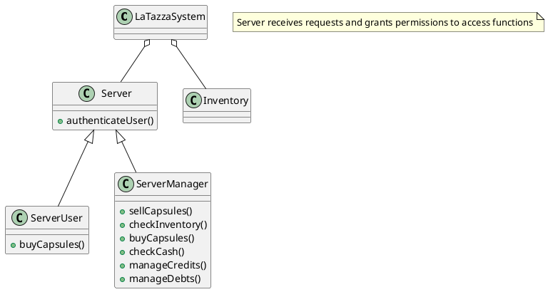

# Requirements Document Template

Authors: Simone Dutto, Isabella Romita, Vito Tassielli, Debora Caldarola

Date: 27/03/2019

Version: 1.0

# Contents

- [Stakeholders](#stakeholders)
- [Context Diagram and interfaces](#context-diagram-and-interfaces)
	+ [Context Diagram](#context-diagram)
	+ [Interfaces](#interfaces) 
	
- [Stories and personas](#stories-and-personas)
- [Functional and non functional requirements](#functional-and-non-functional-requirements)
	+ [Functional Requirements](#functional-requirements)
	+ [Non functional requirements](#non-functional-requirements)
- [Use case diagram and use cases](#use-case-diagram-and-use-cases)
	+ [Use case diagram](#use-case-diagram)
	+ [Use cases](#use-cases)
	+ [Relevant scenarios](#relevant-scenarios)
- [Glossary](#glossary)
- [System design](#system-design)

# Stakeholders


| Stakeholder name  | Description | 
| ----------------- |:-----------:|
| Manager           | Manage capsules purchases and sales and employees accounts  |
| Employees | Buy capsules with their account or in cash |
| Visitors | Buy capsules in cash |
| Capsules Supplier| Supply capsules ordered by manager|
| Credit Card System | Handle payment of Manager to capsules supplier and payment of employees to manager |


# Context Diagram and interfaces
## Context Diagram
```plantuml
left to right direction
skinparam packageStyle rectangle

Actor Manager as m
Actor User as u
Actor "Credit Card System" as cc
Actor "Capsules Supplier" as cs

rectangle system {
  (LaTazza) as lt
  m -- lt
  u -- lt
  lt -- cc
  lt -- cs
}
note "Users are those who consume capsules, so Employee and Visitors" as n
```
## Interfaces
| Actor | Logical Interface | Physical Interface  |
| ------------- |:-------------:| -----:|
| Manager | GUI | Screen and keyboard |
| User | GUI | Screen and keyboard |
| Credit Card System | API to manage payments | Internet |
| Capsule supplier | API to place orders | Internet |

# Stories and personas

### Persona 1
Mary is employed inside a company that uses LaTazza system. She is middle aged, married and has two sons. They are five and eight. 
Every morning she drives her children to school and then goes to work: that usually takes her forty minutes. When she gets to the office, she is usually already tired so a coffee is the first thing she thinks of!
Her workday usually implies dealing with people and make speeches. That is what brings her to use capsules a lot: a cup of coffee or tea is always a good way to get along with someone else! 
At the same time, her payroll does not allow her to exploit those occasions as much as she wished.
Once she finishes working, she goes back home, where her children and husband waits for her to dine all together.

### Persona 2
John is the manager of a company that uses LaTazza system. He lives with his girlfriend, with whom he usually argues a lot. 
He always gets to the office before than anyone else to enjoy his coffee in peace. His wish is for all his employees to create a friendly environment at work. That is why he decided to introduce LaTazza system inside
the office: he would like to see relationships growing among his employees. Even if that takes time to be managed he does not mind doing it, for his collegues' sake.
His workday ends very late: once he is home is so tired he goes immediately to sleep.


# Functional and non functional requirements

## Functional Requirements

| ID        | Description  |
| ------------- |:-------------:| 
|  FR1     | Create employee interface |
|  FR2     | Create manager interface |
|  FR3     | Create employees account |  
|  FR4     | Create manager account |
|  FR5     | Create cash account |
|  FR6     | Add employee |
|  FR7     | Authenticate account |
|  FR8     | Define user authorization level |
|  FR9     | Define manager authorization level |
|  FR10    | Log in |
|  FR11    | Log out |
|  FR12    | Show summary |
|  FR13    | Start sale transaction |
|  FR14    | End sale transaction |
|  FR15    | Delete transaction |
|  FR16    | Store transactions in database |
|  FR17    | Store incomes in database |
|  FR18    | Store outcomes in database |
|  FR19    | Show employees names in manager interface |
|  FR20    | Show sells in manager interface |
|  FR22    | Manager buys supplies of capsules |
|  FR23    | Manager manages credits and debts |
|  FR24    | Manager checks inventory |
|  FR25    | Employee buys capsules |
|  FR26    | Visitor buys capsules |


## Non Functional Requirements

| ID        | Type (efficiency, reliability, ..)           | Description  | Refers to |
| ------------- |:-------------:| :-----:| -----:|
|  NFR1     | Usability | Default language is English | FR\<1>, FR\<2>|
|  NFR2     | Portability | Application runs on Windows, UNIX/Linux and MacOS systems | FR\<1>, FR\<2>|
|  NFR3     | Domain | Currency is € | FR\<16>, FR\<25>, FR\<26>|
|  NFR4     | Usability | Employees can buy with cash or using their account | FR\<25>|
|  NFR5     | Usability | Visitors can only buy capsules with cash | FR\<26>|
|  NFR6     | Privacy | Users have access to their data only | FR\<8>|
|  NFR7     | Privacy | Manager has access to cash account and users info | FR\<9>|
|  NFR8     | Efficiency | Each transaction less than 1/2 sec | FR\<13>, FR\<14>, FR\<16>|
|  NFR9     | Data Integrity | Each transaction is committed to the database | FR\<16>, FR\<17>, FR\<18> |
|  NFR10    | Reliability | In case of system failures data is retrieved using a log file | FR\<16>, FR\<17>, FR\<18> |
|  NFR11    | Platform constraints | Different kind of capsules may be bought (Coffee, Arabic coffee, Tea, Lemon-tea, Camomile-tea) | FR\<1>, FR\<2>|
|  NFR12    | Platform constraints| The inventory shows the number of remaining capsules per type | FR\<24> |
|  NFR13    | Usability | User may undo a transaction | FR\<13>, FR\<14> |
|  NFR14    | Usability | User buys credits to purchase capsules | FR\<25> |


# Use case diagram and use cases


## Use case diagram
```plantuml

left to right direction
skinparam packageStyle rectangle

actor Manager as m
actor User as u
actor "Capsule Supplier" as s
actor "CreditCard System" as c

(Buy Boxes from Supplier) <-- m
s <-- (Buy Boxes from Supplier)

u --> (Buy Capsules from Manager)
(Sell Capsules to User) --> m

(Buy Boxes from Supplier) --> c
(Buy Capsules from Manager) --> c
(Sell Capsules to User) --> c

(Sell Capsules to User) .> (Check the Inventory): include
(Sell Capsules to User) .> (Check the Cash Account): include
(Sell Capsules to User) .> (Manage Credit and Debt of the Employees): include


(Record Payments) <. (Manage Credit and Debt of the Employees): include


(Buy Capsules from Manager) .> (Pay by Cash or by Credits): include
note "If the User is a visitor the payment can be done only by cash" as n
(Pay by Cash or by Credits) -- n

```


## Use Cases
1. Buy Boxes from Supplier
2. Sell Capsules to User

### Use case 1, Buy Boxes from Supplier
| Actors Involved        | Manager, Supplier |
| ------------- |:-------------:| 
|  Precondition     | The manager has to order n boxes of a certain type of beverage |  
|  Post condition     | The manager has received the boxes, the inventory has been updated and the supplier has received the money |
|  Nominal Scenario     | The manager selects the number of boxes and the type of beverage and sends the order |
|  Variants     | If there is insufficient money an error is displayed and the order is rejected |

### Use case 2, Sell Capsules to User
| Actors Involved        | Manager, User |
| ------------- |:-------------:| 
|  Precondition     | There is a pending request done by a user |  
|  Post condition     | The user has received the capsules, the inventory has been updated and the manager has received the money |
|  Nominal Scenario     | The manager reads the user's request and makes the order selecting the beverage type, number of capsule and payment type (by cash or credits) |
|  Variants     | If there is insufficient money (or credits) or capsules an error is displayed and the order is rejected |


# Relevant scenarios
## Scenario 1 : Buy boxes

| Scenario ID: SC1        | Corresponds to UC: Buy Boxes from Supplier |
| ------------- |:-------------:| 
| Step#        | Description  |
|  1     | The manager chooses the number of boxes |  
|  2     | The manager chooses the type of beverage |
|  3     | The manager confirms the order clicking the "Buy" button |
|  4     | The capsule supplier receives the order and the money |
|  5     | The capsule supplier delivers the boxes  |
|  6     | The manager receives the boxes |
|  7     | The inventory is updated |

## Scenario 2 : Sell Capsules to an Employee

| Scenario ID: SC2        | Corresponds to UC: Sell Capsules to User |
| ------------- |:-------------:| 
| Step#        | Description  |
|  1     | The manager receives the capsule order from the Employee |  
|  2     | The manager checks the inventory to see if there is enough quantity of the ordered capsules |
|  3     | The manager checks the cash account of the Employee (through the account) |
|  4     | The manager selects the payment method (indicated from the Employee), the user name, beverage type and quantity and clicks the "Sell" button |
|  5     | The inventory is updated |

## Scenario 3 : Sell Capsules to a Visitor

| Scenario ID: SC3        | Corresponds to UC: Sell Capsules to User |
| ------------- |:-------------:| 
| Step#        | Description  |
|  1     | The manager takes the capsule order from the Visitor |  
|  2     | The manager checks the inventory to see if there is enough quantity of the ordered capsules |
|  3     | The manager receives the money from the Visitor (by cash) |
|  4     | The manager delivers the capsules to the Visitor  |
|  5     | The inventory is updated |

# Glossary
```plantuml

class Employee{
  ID
}

class Manager{
  ID
  name
  surname
}

class User{
  name
  surname
}

class Visitor{
}

class Supplier{
  ID
  name
  surname
}

class Account{
  ID
  password
  availableCredits
}

class CreditCard{
  IBAN
  expirationDate
  balance
}

class Inventory{
  productID
  availableQty
}

User <|-- Employee
User <|-- Visitor
User "*" -- "1..*" Manager
Employee "1"--"1" Account
Account "1"-- "1" CreditCard
Manager "1..*"--"1..*" Inventory
Manager "*"--"1..*" Supplier
Manager "1"--"1" Account

note "the Manager is also an Employee, but since he is not a User we decided to separate them" as n
n -- Manager

```

# System Design

```
