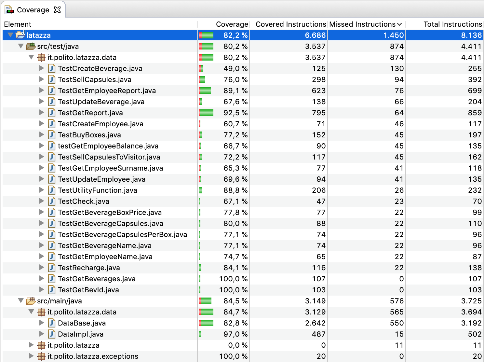

# Unit Testing Documentation template

Authors: Debora Caldarola, Isabella Romita, Simone Dutto, Vito Tassielli

Date: 31/5/2019

Version: 3.0

Change history

| Version | Changes | 
| ----------------- |:-----------|
| 3 | Added test cases to handle insertion of null values |
| 2 | Added negative balance warning |

# Contents

- [Black Box Unit Tests](#black-box-unit-tests)

- [White Box Unit Tests](#white-box-unit-tests)

# Black Box Unit Tests

 ### **Class *DataImpl* - method *createBeverage***

**Criteria for method *createBeverage*:**
	

 - Valid beverage name 
 - Range of number of capsules per box
 - Range of box price
 - Duplicate beverage
 

**Predicates for method *createBeverage*:**

|         Criteria           | Predicate |
| -------------------------- | --------- |
| Beverage name              | Empty string     |
|							 | Not empty string|
|| Null|
|| Not Null |
| Number of capsules per box | Valid            |
|							 | Not valid        |
| Box price                  | Valid            |
|							 | Not valid        |
| Duplicate beverage		 | Beverage with same name already exists |
|							 | Beverage with same name does not exist yet |

**Boundaries**:

|          Criteria         | Boundary values     |
| ------------------------- | ------------------- |
| Beverage name				| String length = 0   |
|							| String length > 0   |
| Range of capsules per box | > 0 and <= Integer.MAX_VALUE |
| 							| <= 0 or > Integer.MAX_VALUE |
| Range of box price        | > 0 and <= Integer.MAX_VALUE |
|							| <= 0 or > Integer.MAX_VALUE |

**Combination of predicates**:

| Valid beverage name | Number of capsules per box | Box price    | Duplicate employee | Valid / Invalid | Description of the test case    | JUnit test case |
|---------------------|---------------------------|-----------------------|-----------------|--------|--------------------------------|-------|
| Yes 				  | > 0	and <= Integer.MAX_VALUE | > 0 and <= Integer.MAX_VALUE | No | Valid | Test the method to add a new beverage in the database | TestCreateBeverage.testValidInputs() |
| Yes  				  | > 0	and <= Integer.MAX_VALUE | < 0 and <= Integer.MAX_VALUE | Yes | Invalid | Test the method to add a new beverage in the database with already existing employee | TestCreateBeverage.testDuplicateBeverage() |
| Yes 				  | > 0	and <= Integer.MAX_VALUE | < 0  | No | Invalid | Test the method to add a new beverage in the database with negative box price | TestCreateBeverage.testNegativeBoxPrice() |
| Yes 				  | > 0	and <= Integer.MAX_VALUE | = 0 | No | Invalid | Test the method to add a new beverage in the database with 0 box price | TestCreateBeverage.testZeroBoxPrice() |
| Yes 				  | > 0	and <= Integer.MAX_VALUE | > Integer.MAX_VALUE | No | Invalid | Test the method to add a new beverage in the database with too big box price | TestCreateBeverage.testOverflowBoxPrice() |
| Yes 				  | < 0	| > 0 and <= Integer.MAX_VALUE | No |Invalid | Test the method to add a new beverage in the database with negative number of capsules per box | TestCreateBeverage.testNegativeNumberOfCapsules() |
| Yes 				  | = 0	| > 0 and <= Integer.MAX_VALUE | No |Invalid | Test the method to add a new beverage in the database with 0 number of capsules per box | TestCreateBeverage.testNullNumberOfCapsules() |
| Yes 				  | > Integer.MAX_VALUE	| > 0 and <= Integer.MAX_VALUE | No |Invalid | Test the method to add a new beverage in the database with too big number of capsules per box | TestCreateBeverage.testOverflowNumberOfCapsules() |
| No  				  | > 0 and <= Integer.MAX_VALUE | > 0 and <= Integer.MAX_VALUE | No | Invalid |Test the method to add a new beverage in the database with wrong beverage name | TestCreateBeverage.testWrongBeverageName() |
| No                  | > 0	and <= Integer.MAX_VALUE | > 0 and <= Integer.MAX_VALUE | No | Not Valid | Test the method with null name  | TestCreateBeverage.testNullBeverageName() | 
| Yes               | not valid | > 0 and <= Integer.MAX_VALUE | No | Not Valid | Test the method with null numberOfCapsules  | TestCreateBeverage.testNullNumberOfCapsules() |
| Yes                  | > 0	and <= Integer.MAX_VALUE | Valid | NotValid | Not Valid | Test the method with null name  | TestCreateBeverage.testNullBoxPrice() | 

### **Class *DataImpl* - method *createEmployee***

**Criteria for method *createEmployee*:**
	

 - Valid employee name 
 - Valid employee surname
 - Duplicate employee
 
Null values are not allowed by the GUI interface.

**Predicates for method *createEmployee*:**

|         Criteria           | Predicate |
| -------------------------- | --------- |
| Employee name              | Empty string     |
|							 | Not empty string |
| Null | Not Null |
| Employee surname           | Empty string     |
|							 | Not empty string |
| Duplicate employee		 | Employee with same name and surname already exists |
|							 | Employee with same name and surname does not exist yet |

**Boundaries**:

|          Criteria         | Boundary values     |
| ------------------------- | ------------------- |
| Employee name 			| String length = 0   |
| 							| String length > 0   |
| Employee surname 			| String length = 0   |
| 							| String length > 0   |

**Combination of predicates**:

| Valid employee name | Valid employee surname | Duplicate Employee    | Valid / Invalid | Description of the test case    | JUnit test case |
|---------------------|---------------------------|-----------------------|-----------------|---------------------------------|-------|
| Yes | Yes | No | Valid | Test method to add new employee in the database | TestCreateEmployee.testValidInputs() |
| Yes | Yes | Yes | Invalid | Test method to add new employee in the database with duplicate employee | TestCreateEmployee.testDuplicateEmployee() |
| Yes | No | No | Invalid | Test method to add new employee in the database with not valid surname | TestCreateEmployee.testWrongSurname() |
| No | Yes | No | Invalid | Test method to add new employee in the database with not valid name | TestCreateEmployee.testWrongName() |
| No | Yes | No | Not Valid | Test method with null name | TestCreateEmployee.testNullName() |
| Yes | No | No | Not Valid | Test method with null surname | TestCreateEmployee.testNullSurname() |

 ### **Class *DataImpl* - method *sellCapsules***

**Criteria for method *sellCapsules*:**
	

 - Existence of EmployeeId
 - Existence of BeverageId
 - Sign of NumberOfCapsules
 - Value of fromAccount

I decided not to consider the type of the arguments because Java Compiler already does control the type.

**Predicates for method *sellCapsules*:**

| Criteria | Predicate |
| -------- | --------- |
|  EmployeeId        |   It exists        |
|                                 |   It doesn't exist          |
| Existence of BeverageId         |   It exists        |
|                                 |   It doesn't exist          |
|  NumberOfCapsules       |   Major than NumberOfCapsules present          |
|                                 |   Minor |
| Value of fromAccount            |   True    |
|                                 |   False    |
| Range of NumberOfCapsules |   Minor of maximum
|  |     Major of maximum |
| Balance | Positive |
| | Negative |

**Boundaries**:

| Criteria | Boundary values |
| -------- | --------------- |
|  Range Number       | MAXINT                 |
|                     | 0   |
| NumberOfCapsule | = NumberOfCapsules bought by manager |

**Combination of predicates**:

| Valid EmployeeId |  Valid  BeverageId  | NumberOfCapsules  | Value of fromAccount | Range of NumberOfCapsules | Balance is positive | Valid / Invalid | Description of the test case | JUnit test case |
|-------|-------|-------|-------|-------|-------|-------|------|------|
|Yes| Yes| Minor | True| Minor| Yes | Valid| Test the function to sell to Employee with account  | TestSellCapsules.testSellCapsuleAccount() |
|Yes| Yes| Minor | False| Minor| Yes | Valid| Test the function to sell to Employee without account  | TestSellCapsules.testSellCapsuleNoAccount() |
|No| Yes| Minor | True| Minor| Yes | Invalid| Test the function with wrong EmployeeId| TestSellCapsules.testEmployeeIdNotValid() |
|Yes | No| Minor| True| Minor| Yes | Invalid| Test the function with wrong BeverageId| TestSellCapsules.testBeverageIdNotValid() |
|Yes | Yes | Major| True| Minor| Yes | Invalid| Test the function with NumberOfCapsules exceeding limit| TestSellCapsules.testNumberOfCapsulesTooBig() | 
|Yes | Yes | Minor| True | Yes | Major| Invalid| Test the function with MAXINT as NumberOfCapsules| TestSellCapsules.testMaxNumberOfCapsulesNotValid()|
|Yes | Yes | Minor | True | Minor | No | Valid | Test the function with resulting negative balance | TestSellCapsules.testNegativeBalance() |
|No | Yes| Minor | True| Minor| Yes | Not Valid| Test the function to sell to Employee null  | TestSellCapsules.testNullEmployeeId() |
|Yes| No| Minor | True| Minor| Yes | Not Valid| Test the function to sell null beverage  | TestSellCapsules.testNullBeverageId() |
|Yes| Yes| Minor | Null | Minor| Yes | Not Valid| Test the function to sell to null number of capsules  | TestSellCapsules.testNullNumberOfCapsules() |

 ### **Class *DataImpl* - method *sellCapsulesToVisitor***

**Criteria for method **sellCapsulesToVisitor:**
	
 - Existence of BeverageId
 - Sign of NumberOfCapsules

I decided not to consider the type of the arguments because Java Compiler already does control the type.

**Predicates for method *sellCapsulesToVisitor*:**

| Criteria | Predicate |
| -------- | --------- |
| BeverageId         |   It exists        |
|                                 |   It doesn't exist          |
|| Null |
| | Not Null | 
|  NumberOfCapsules       |   Major than NumberOfCapsules present          |
|                                 |   Minor |
|| Null| 
|| Not Null| 
| Range of NumberOfCapsules |   Minor of maximum
|  |     Major of maximum |

**Boundaries**:

| Criteria | Boundary values |
| -------- | --------------- |
|  Range Number       | MAXINT                 |
|                     | 0   |
| NumberOfCapsule | = NumberOfCapsules bought by manager |

**Combination of predicates**:

Valid BeverageId  | NumberOfCapsules  | Range of NumberOfCapsules | Valid / Invalid | Description of the test case | JUnit test case |
|-------|-------|-------|-------|-------|-------|
| Yes| Minor |  Minor|  Valid| Test the function to sell to Visitor  | TestSellCapsulesToVisitor.testSellCapsules() |
| No| Minor|  Minor| Invalid| Test the function with wrong BeverageId| TestSellCapsulesToVisitor.testBeverageIdNotValid() |
| Yes | Major| Minor| Invalid| Test the function with NumberOfCapsules exceeding limit| TestSellCapsulesToVisitor.testNumberOfCapsulesTooBig() | 
| Yes | Minor| Major| Invalid| Test the function with MAXINT as NumberOfCapsules| TestSellCapsulesToVisitor.testMaxNumberOfCapsulesNotValid()|
| No | Minor |  Minor|  Invalid| Test the function to sell with beverageIdNUll  | TestSellCapsulesToVisitor.testNullBeverageId() |
| Yes| null |  Minor|  Invalid| Test the function to sell to Visitor  | TestSellCapsulesToVisitor.testNullNumberOfCapsules() |
### **Class *DataImpl* - method *getEmployeeReport***

**Criteria for method **getEmployeeReport:**
	
 - Existence of EmployeeId
 - Valid Date Range

I decided not to consider the type of the arguments because Java Compiler already does control the type.

**Predicates for method *getEmployeeReport*:**

| Criteria | Predicate |
| -------- | --------- |
| Existence of EmployeeId         |   It exists        |
|                                 |   It doesn't exist          |
|  Range Date       |  Valid         |
|                   |  Invalid |
| Date | Not null |
| | Null | 

**Boundaries**:

| Criteria | Boundary values |
| -------- | --------------- |
|  Range Date      | EndDate = StartDate                 |

**Combination of predicates**:

Existence of EmployeeId  | Date Range | Date | Valid / Invalid | Description of the test case | JUnit test case |
|-------|-------|-------|-------|-------|-----------|
| Yes| Valid | Not null | Valid| Test the function to get report of employee withing a date range  | TestGetReportEmployee.testGetEmployeeReport() |
| No| Valid | Not null |  Invalid| Test the function with wrong EmployeeId| TestGetReportEmployee.testEmployeeIdNotValid() |
| Yes | Invalid | Not null | Invalid | Test the function with startDate > EndDate | TestGetReportEmployee.testWrongDate() |
| Yes | Valid| Not null | Valid| Test the function with StartDate = EndDate | TestGetReportEmployee.testEqualDates() |
| Yes | Valid | Null | Invalid | Test the function with one date = null | TestGetReportEmployee.testNullDates() | 

### **Class *DataImpl* - method *getReport***

**Criteria for method **geReport:**
	
 - Existence of EmployeeId
 - Valid Date Range

I decided not to consider the type of the arguments because Java Compiler already does control the type.

**Predicates for method *getReport*:**

| Criteria | Predicate |
| -------- | --------- |
| EmployeeId         |   It exists        |
|                                 |   It doesn't exist          |
|  Range Date       |  Valid         |
|                   |  Invalid |
| Date | Not null |
| | Null | 

**Boundaries**:

| Criteria | Boundary values |
| -------- | --------------- |
|  Range Date      | EndDate = StartDate                 |

**Combination of predicates**:

| Date Range | Date | Valid / Invalid | Description of the test case | JUnit test case |
|-------|-------|-------|-------|-------|
| Valid | Not null | Valid| Test the function to get report of employee withing a date range  | TestGetReport.testGetReport() |
| Invalid | Not null |  Invalid| Test the function with startDate > EndDate| TestGetReport.testWrongDates() |
| Valid | Null | Invalid | Test the function  with null date| TestGetReport.testNullDate() |
| Valid| Not null | Valid| Test the function with StartDate = EndDate | TestGetReportEmployee.testEqualDates() |

### **Class *DataImpl* - method *rechargeAccount***
**Criteria for method *rechargeAccount*:**
	

 - Existence of employeeId
 - Value of amountInCents

**Predicates for method *rechargeAccount*:**

| Criteria | Predicate |
| -------- | --------- |
| EmployeeId | it exists |
|          | it does not exist|
| | Null |
|| Not Null |
| Value of amountInCents| > 0 |
|  | <= 0 |
|| Null| 
|| Not Null|

**Combination of predicates**:

| Valid EmployeeId | Value of amountInCents | Valid / Invalid | Description of the test case | JUnit test case |
|-------|-------|-------|-------|-------|
|Yes | > 0 | V | Test the function in standard conditions| TestRecharge.TestRechargeBalance()|
||0|V| Test the function with amountInCents = 0 | TestRecharge.TestRechargeWithZero()|
| No | > 0 | I | Test the function when the EmployeeException is thrown| TestRecharge.TestRechargeException()|
| No | > 0 | I | Test the function with null EmployeeId| TestRecharge.TestNullEmployeeId()|
|Yes | null | V | Test the function with null AmountInCents| TestRecharge.TestNullAmountInCents()|

### **Class *DataImpl* - method *getEmployeeSurname***

**Criteria for method *getEmployeeSurname*:**
	

 - Valid employee ID

**Predicates for method *getEmployeeSurname*:**

|         Criteria           | Predicate |
| -------------------------- | --------- |
| Employee ID                | Exists in the database     |
|							 | Does not exist in the database |
| | Null | 
| | Not Null | 

**Boundaries**:

|          Criteria         | Boundary values     |
| ------------------------- | ------------------- |
| Employee ID				| > 0 and <= MAX(EmployeeID)   |
|							| <= 0 or > MAX(EmployeeID)   |

**Combination of predicates**:

| Employee ID | Valid / Invalid | Description of the test case    | JUnit test case |
|---------------------|---------------------------|-----------------------|-----------------|
| > 0	and <= MAX(EmployeeID) | Valid | Test the method to retrieve the surname of the employee with given ID | TestGetEmployeeSurname.testValidInputs() |
| < 0 | Invalid | Test the method to retrieve the surname of the employee with given negative ID | TestGetEmployeeSurname.testNegativeId() |
| Null | Invalid | Test the method to retrieve the surname of the employee with given null ID | TestGetEmployeeSurname.testNullId() |
| > MAX(EmployeeID) | Invalid | Test the method to retrieve the surname of the employee null | TestGetEmployeeSurname.testOutOfMaxBoundaryId() |

 ### **Class *DataImpl* - method *updateBeverage***

**Criteria for method *updateBeverage*:**
	

 - Existence of BeverageId
 - name of the beverage is null
 - boxPrice is 0
 - capsulesPerBox is 0
 - update of price is possible only once if the old capsules are not all sold

**Predicates for method *updateBeverage*:**

| Criteria | Predicate |
| -------- | --------- |
| BeverageId | it exists |
|          | it does not exist|
|| Null |
| | Not Null
| name of the beverage| Empty |
|  | not Empy |
| | Null | 
| | Not Null |
| boxPrice | = 0 |
|| != 0 |
| | Null | 
| | Not Null |
| capsulesPerBox | = 0 |
| | != 0|
| pricePerCapsules | allowed |
| | not allowed |

A new price is not allowed when there has already been a variation to the price and capsules with old price are not sold out.

**Combination of predicates**:

I decided not to consider the type of the arguments because Java Compiler already does control the type.
I didn't considered null input of any arguments because GUI didn't allow null inputs.

| Valid beverageId | name of the beverage| boxPrice | capsulesPerBox | pricePerCapsules | Valid / Invalid | Description of the test case | JUnit test case |
|-------|-------|-------|-------|-------|-------|-------|------|
|Yes | Valid| != 0 | != 0 | Valid | V | Test the function in standard conditions| TestUpdateBeverage.TestUpdateBev()|
| Yes | Invalid | | | | I | Test the function when BeverageException is thrown because the name is an empty string| TestUpdateBeverage.TestExceptionName()|
|Yes ||= 0|| | I | Test the function when BeverageException is thrown because boxPrice = 0| TestUpdateBeverage.TestExceptionPrice()|
|Yes ||||0|I| Test the function when BeverageException is thrown because capsulesPerBox = 0 | TestUpdateBeverage.TestExceptionBox()|
| No ||| || I | Test the function when the BeverageException is thrown because ID not valid| TestUpdateBeverage.TestExceptionId()|
|No | Not null| != 0 | != 0 | |I | Test the function null BeverageId| TestUpdateBeverage.TestNullBeverageId()|
|Yes | null| != 0 | != 0 || I | Test the function null beverage Name| TestUpdateBeverage.TestNullBeverageName()|
|Yes | not null| Null | != 0 | |I | Test the function null capsules per box| TestUpdateBeverage.TestNullCapsulesPerBox()|
|Yes | Valid | != 0 | !=0 | Allowed | Test the function when the new price is allowed | TestUpdateBeverage.testUpdateOldCapsules() |
|Yes | Valid | != 0 | !=0 | Not allowed | Test the function when the new price is not allowed | TestUpdateBeverage.testUpdateOldCapsulesException() |
|Yes | Valid | != 0 | !=0 | Allowed | Test the function when the new price is allowed after selling old capsules | TestUpdateBeverage.testPriceUpdateAfterSell() |

 
 ### **Class *DataImpl* - method *updateEmployee***

**Criteria for method *updateEmployee*:**
	

 - Existence of employeeId
 - name of the employee is null
 - surname of the employee is null

**Predicates for method *updateEmployee*:**

| Criteria | Predicate |
| -------- | --------- |
| Existence of employeeId | it exists |
|          | it does not exist|
| | Null|
| | Not Null | 
| name of the employee| empty |
|  | not empty |
| surname of the employee| empty |
|  | not empty |

**Combination of predicates**:

| Valid employeeId | name of the employee| surname of the employee | Valid / Invalid | Description of the test case | JUnit test case |
|-------|-------|-------|-------|-------|-------|
|Yes | Valid| not null | V | Test the function in standard conditions| TestUpdateEmployee.TestUpdateEmp()|
| Yes | invalid |  | I | Test the function when EmployeeException is thrown because the name is an empty string| TestUpdateEmployee.TestExceptionName()|
| Yes |  | Invalid | I | Test the function when EmployeeException is thrown because the surname is an empty string| TestUpdateEmployee.TestExceptionName()|
| No | Valid |  Valid|  | Test the function when the EmployeeException is thrown because ID not valid| TestUpdateEmployee.TestExceptionId()|
| No | Valid| Valid | I | Test the function with null EmployeeId| TestUpdateEmployee.TestNullEmployeeId()|
|Yes | Null| valid | I | Test the function with null name| TestUpdateEmployee.TestNullName()|
|Yes | Valid| Null | I | Test the function with null surname| TestUpdateEmployee.TestNullSurname()|

### **Class *DataImpl* - method *getEmployeeBalance***

**Criteria for method *getEmployeeBalance*:**
	

 - Valid employee ID

**Predicates for method *getEmployeeBalance*:**

|         Criteria           | Predicate |
| -------------------------- | --------- |
| Employee ID                | Exists in the database     |
|							 | Does not exist in the database |

**Boundaries**:

|          Criteria         | Boundary values     |
| ------------------------- | ------------------- |
| Employee ID				| > 0 and <= MAX(EmployeeID)   |
|							| <= 0 or > MAX(EmployeeID)   |

**Combination of predicates**:

| Employee ID | Valid / Invalid | Description of the test case    | JUnit test case |
|---------------------|---------------------------|-----------------------|-----------------|
| > 0 and <= MAX(EmployeeID) | Valid | Test the method to retrieve the balance of the employee with given ID | TestGetEmployeeBalance.testValidInputs() |
| < 0 | Invalid | Test the method to retrieve the balance of the employee with given negative ID | TestGetEmployeeBalance.testNegativeId() |
| Null | Invalid | Test the method to retrieve the balance of the employee with given null ID | TestGetEmployeeBalance.testNullId() |
| > MAX(EmployeeID) | Invalid | Test the method to retrieve the balance of the employee with given out of maximum boundary ID | TestGetEmployeeBalance.testOutOfMaxBoundaryId() |

### **Class *DataImpl* - method *buyBoxes***

**Criteria for method *buyBoxes*:**
	

 - Existence of BeverageID
 - Sign of boxQuantity

I decided not to consider the type of the arguments because Java Compiler already does control the type.
I didn't considered null input of any arguments because GUI didn't allow null inputs.

**Predicates for method *buyBoxes*:**

| Criteria | Predicate |
| -------- | --------- |
| Existence of BeverageId         |   It exists        |
|                                 |   It doesn't exist          |
| | Null | 
| | Not Null |
|  boxQuantity         |   Major than managerBalance/boxPrice          |
|                                 |   Minor |
| | Null | 
| | Not Null |
| Range of boxQuantity |   Minor of maximum
|  |     Major of maximum |

**Boundaries**:

| Criteria | Boundary values |
| -------- | --------------- |
|  Range Number       | MAXINT                 |
|                     | 0   |
| boxQuantity | = managerBalance/boxPrice |

**Combination of predicates**:

|Valid BeverageId  |boxQuantity  | Range of boxQuantity | Valid / Invalid | Description of the test case | JUnit test case |
|-------|-------|-------|-------|-------|-------|
| Yes| Minor |  Minor|  Valid| Test the function to buy boxes  | TestBuyBoxes.testBuyBoxes() |
| No| Minor|  Minor| Invalid| Test the function with wrong BeverageId| TestBuyBoxes.testBeverageIdNotValid() |
| Yes | Major| Minor| Invalid| Test the function with boxQuantity exceeding limit| TestBuyBoxes.testBoxQuantityTooBig() | 
| Yes | Minor| Major| Invalid| Test the function with MAXINT as boxQuantity| TestBuyBoxes.testMaxBoxQuantityNotValid()|
| No| Minor |  Minor|  InValid| Test the function with beverageId null  | TestBuyBoxes.testBeverageIdNull() |
| Yes| Null |  Minor|  InValid| Test the function to buy boxes  | TestBuyBoxes.testNullBoxQUantity() |

 ### **Class *DataImpl* - method *getBeverageName***

**Criteria for method *getBeverageName*:**
	

 - Existence of BeverageID

I decided not to consider the type of the arguments because Java Compiler already does control the type.
I didn't considered null input of any arguments because GUI didn't allow null inputs.

**Predicates for method *getBeverageName*:**

| Criteria | Predicate |
| -------- | --------- |
| Existence of BeverageId         |   It exists        |
|                                 |   It doesn't exist          |
| | Null | 
| | Not Null |

**Combination of predicates**:

Valid of BeverageId  | Valid / Invalid | Description of the test case | JUnit test case |
|-------|-------|-------|-------|
| Yes  | Valid | Test the function to get beverage name | TestGetBeverageName.testGetNameValid() |
| No  | Invalid | Test the function to check beverageId | TestGetBeverageName.testBeverageIdNotValid() |
| No | InValid | Test the function to get beverage name | TestGetBeverageName.testNullBeverageId() |

 ### **Class *DataImpl* - method *getBeverageCapsulesPerBox***

**Criteria for method *getBeverageCapsulesPerBox*:**
	

 - Existence of BeverageID

I decided not to consider the type of the arguments because Java Compiler already does control the type.
I didn't considered null input of any arguments because GUI didn't allow null inputs.

**Predicates for method *getBeverageCapsulesPerBox*:**

| Criteria | Predicate |
| -------- | --------- |
| BeverageId         |   It exists        |
|                                 |   It doesn't exist          |
| | Null |
| | Not Null | 

**Combination of predicates**:

Valid BeverageId  | Valid / Invalid | Description of the test case | JUnit test case |
|-------|-------|-------|-------|
| Yes  | Valid | Test the function to get beverage capsules per box | TestGetBeverageCapsulesPerBox.testCapsulesPerBoxValid() |
| No  | Invalid | Test the function to check beverageId | TestGetBeverageCapsulesPerBox.testBeverageIdNotValid() |
| No   | Inalid | Test the function with null beverageId | TestGetBeverageCapsulesPerBox.testNullBeverageId() |

 ### **Class *DataImpl* - method *getBeverageBoxPrice***

**Criteria for method *getBeverageBoxPrice*:**
	

 - Existence of BeverageID

I decided not to consider the type of the arguments because Java Compiler already does control the type.
I didn't considered null input of any arguments because GUI didn't allow null inputs.

**Predicates for method *getBeverageBoxPrice*:**

| Criteria | Predicate |
| -------- | --------- |
| BeverageId         |   It exists        |
|                                 |   It doesn't exist          |
| | Null | 
| | Not Null | 

**Combination of predicates**:

| Valid BeverageId  | Valid / Invalid | Description of the test case | JUnit test case |
|-------|-------|-------|-------|
| Yes  | Valid | Test the function to get beverage box price | TestGetBeverageBoxPrice.testGetBoxPriceValid() |
| No  | Invalid | Test the function to check beverageId | TestGetBeverageBoxPrice.testBeverageIdNotValid() |
| No  | InValid | Test the function with nullBoxPrice | TestGetBeverageBoxPrice.testNullBeverageId() |

 ### **Class *DataImpl* - method *getBeverageCapsules***

**Criteria for method *getBeverageCapsules*:**
	

 - Existence of BeverageID

I decided not to consider the type of the arguments because Java Compiler already does control the type.
I didn't considered null input of any arguments because GUI didn't allow null inputs.

**Predicates for method *getBeverageCapsules*:**

| Criteria | Predicate |
| -------- | --------- |
| BeverageId         |   It exists        |
|                                 |   It doesn't exist          |
| | Null | 
| | Not Null |

**Combination of predicates**:

Valid BeverageId  | Valid / Invalid | Description of the test case | JUnit test case |
|-------|-------|-------|-------|
| Yes  | Valid | Test the function to get beverage capsules | TestGetBeverageCapsules.testGetBeverageCapsulesValid() |
| No  | Invalid | Test the function to check beverageId | TestGetBeverageCapsules.testBeverageIdNotValid() |
| No  | Invalid | Test the function with null BeverageId | TestGetBeverageCapsules.testBeverageIdNull() |

 ### **Class *DataImpl* - method *getEmployeeName***

**Criteria for method *getEmployeeName*:**
	

 - Existence of EmployeeID

I decided not to consider the type of the arguments because Java Compiler already does control the type.
I didn't considered null input of any arguments because GUI didn't allow null inputs.

**Predicates for method *getEmployeeName*:**

| Criteria | Predicate |
| -------- | --------- |
| Existence of EmployeeID         |   It exists        |
|                                 |   It doesn't exist          |
| | Null |
| | Not Null |

**Combination of predicates**:

Existence of EmployeeID  | Valid / Invalid | Description of the test case | JUnit test case |
|-------|-------|-------|-------|
| Yes  | Valid | Test the function to get employee name | TestGetEmployeeName.testGetNameValid() |
| No  | Invalid | Test the function to check employeeID | TestGetEmployeeName.testEmployeeIdNotValid() |
| No  | Invalid | Test the function with employeeID null | TestGetEmployeeName.testEmployeeIdNUll() |

# White Box Unit Tests

### Test cases definition

| Unit name | JUnit test case |
|--|--|
| DataImpl | it.polito.latazza.data.TestBuyBoxes() |
| DataImpl | it.polito.latazza.data.TestCreateBeverages() |
| DataImpl | it.polito.latazza.data.TestCreateEmployee() |
| DataImpl | it.polito.latazza.data.TestGetBeverageBoxPrice() |
| DataImpl | it.polito.latazza.data.TestGetBeverageCapsules() |
| DataImpl | it.polito.latazza.data.TestGetBeveragesCapulesPerBox() |
| DataImpl | it.polito.latazza.data.TestGetBeverageName() |
| DataImpl | it.polito.latazza.data.TestGetBeverages() |
| DataImpl | it.polito.latazza.data.TestGetBevId() |
| DataImpl | it.polito.latazza.data.TestGetEmployeeBalance() |
| DataImpl | it.polito.latazza.data.TestGetEmployeeName() |
| DataImpl | it.polito.latazza.data.TestGetEmployeeSurname() |
| DataImpl | it.polito.latazza.data.TestGetEmployeeReport() |
| DataImpl | it.polito.latazza.data.TestGetReport() |
| DataImpl | it.polito.latazza.data.TestRecharge() |
| DataImpl | it.polito.latazza.data.TestSellCapsules() |
| DataImpl | it.polito.latazza.data.TestSellCapsulesToVisitor() |
| DataImpl | it.polito.latazza.data.TestUpdateBeverage() |
| DataImpl | it.polito.latazza.data.TestUpdateEmployee() |
| DataImpl | it.polito.latazza.data.TestUtilityFunction() |
| DataBase | it.polito.latazza.data.TestCheck() |

### Code coverage report

    

### Loop coverage analysis

    <Identify significant loops in the units and reports the test cases
    developed to cover zero, one or multiple iterations >
    
    In total we have 5 loop in our code:
    - 3 loops for the getReport() method
        1. to read the Sells Table
        2. to read the Recharges Table
        3. to read the Purchases Table
    - 2 loop for the getEmployeeReport() method
        1. to read the Sells Table
        2. to read the Recharges Table
    
|Unit name | Loop rows | Number of iterations | JUnit test case |
|---|---|---|---|
| DataBase.getRep() | 872, 916, 945 | 0 | it.polito.latazza.data.TestGetReport.testGetReportNoLoop() |
| DataBase.getRep() | 872-903, 908 | 2 | it.polito.latazza.data.TestGetReport.testGetReportSellLoop() |
| DataBase.getRep() | 872-891, 906-908 | 1 | it.polito.latazza.data.TestGetReport.testGetReportSellVisLoop() |
| DataBase.getRep() | 916-937 | 2 | it.polito.latazza.data.TestGetReport.testGetReportRechargeLoop() |
| DataBase.getRep() | 945-964 | 2 | it.polito.latazza.data.TestGetReport.testGetReportBuyBoxLoop() |
| DataBase.getEmplRep() | 764, 806 | 0 | it.polito.latazza.data.TestGetEmployeeReport.testGetEmployeeRepNoLoop() |
| DataBase.getEmplRep() | 806-827 | 1 | it.polito.latazza.data.TestGetEmployeeReport.testGetEmployeeReportRechLoop() |
| DataBase.getEmplRep() | 764-797 | 2 | it.polito.latazza.data.TestGetEmployeeReport.testGetEmployeeReportSellLoop() |

