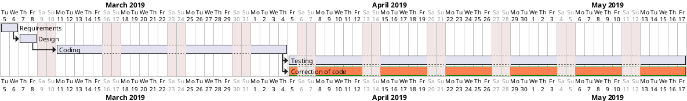

# Project Estimation  template

Authors: Isabella Romita, Vito Tassielli, Debora Caldarola, Simone Dutto

Date: 31/05/19

Version: 1

# Contents

- [Data from your LaTazza project]

- [Estimate by product decomposition]
- [Estimate by activity decomposition ]

# Data from your LaTazza project

###
|||
| ----------- | ------------------------------- | 
|         Total person hours  worked by your  team, considering period March 5 to May 26, considering ALL activities (req, des, code, test,..)    |138  |             
|Total Java LoC delivered on May 26 (only code, without Exceptions, no Junit code) | 1934 |
| Total number of Java classes delivered on May 26 (only code, no Junit code, no Exception classes)| 2 |
| Productivity P =| 14 (LoC / total person hours) |
|Average size of Java class A = | 967 |

# Estimate by product decomposition

### 

|             | Estimate                        |             
| ----------- | ------------------------------- |  
| Estimated n classes NC (no Exception classes)  |             7                |             
| Estimated LOC per class  (Here use Average A computed above )      |              967              | 
| Estimated LOC (= NC * A) | 6769|
| Estimated effort  (person days) (Here use productivity P)  |           14                          |      
| Estimated calendar time (calendar weeks) (Assume team of 4 people, 8 hours per day, 5 days per week ) |          3          |               

# Estimate by activity decomposition

### 

|         Activity name    | Estimated effort    |             
| ----------- | ------------------------------- | 
|Requirements | 1.25 (person days) |
|Design | 1.87 (person days) |
|Coding | 18.79 (person days)  |
|Testing | 30.6 (person days) |

###
Insert here Gantt chart with above activities

